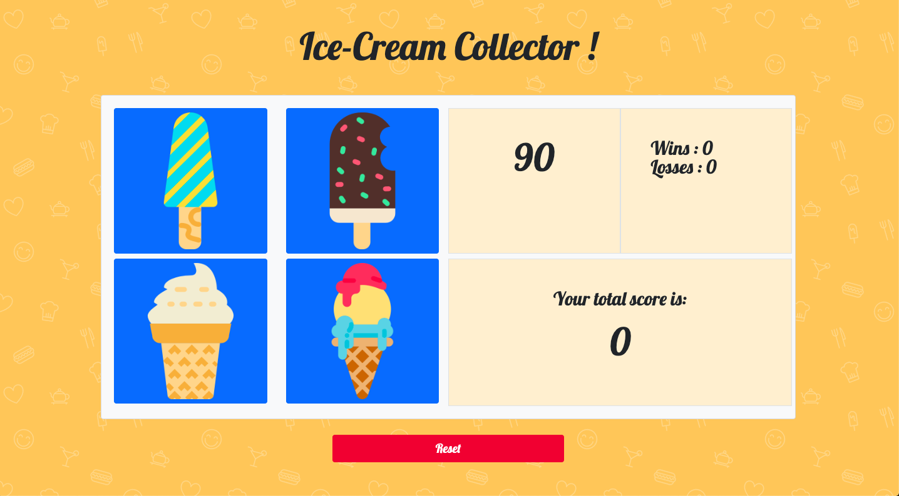

# unit-4-game

## Quick start
Open [index](https://victoire44.github.io/unit-4-game) in your browser.

## Presentation
The purpose of this assignment from UC Berkeley extension is to create a game in JavaScript with JQuery.  
 
**Ice Cream collector** is a guessing game. The purpose of this this game is to match your total of your numbers to the random number gived at the start of the game. Each ice-cream has its own hidden value.
  If your total is superior than the random number, you lose  !

## Technologies Used

* [HTML](https://developer.mozilla.org/en-US/docs/Web/HTML)
* [CSS](https://developer.mozilla.org/en-US/docs/Web/CSS)
* [Bootstrap](https://getbootstrap.com/)
* [JavaScript](https://developer.mozilla.org/en-US/docs/Web/JavaScript)
* [jQuery](https://jquery.com/)

## Author

Victoire Baron